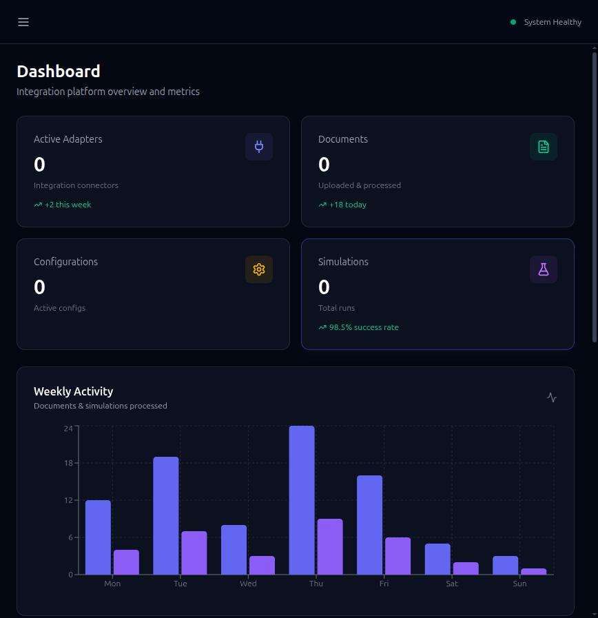
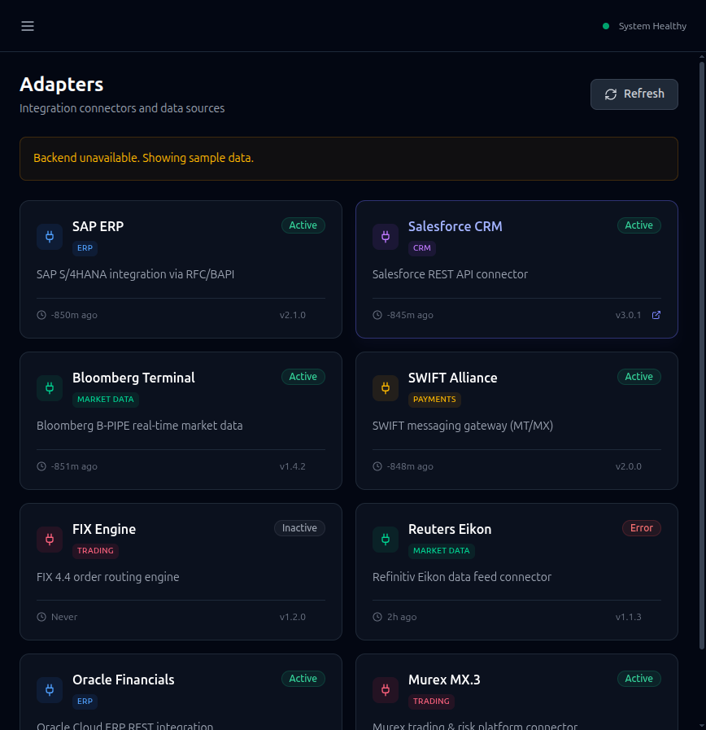
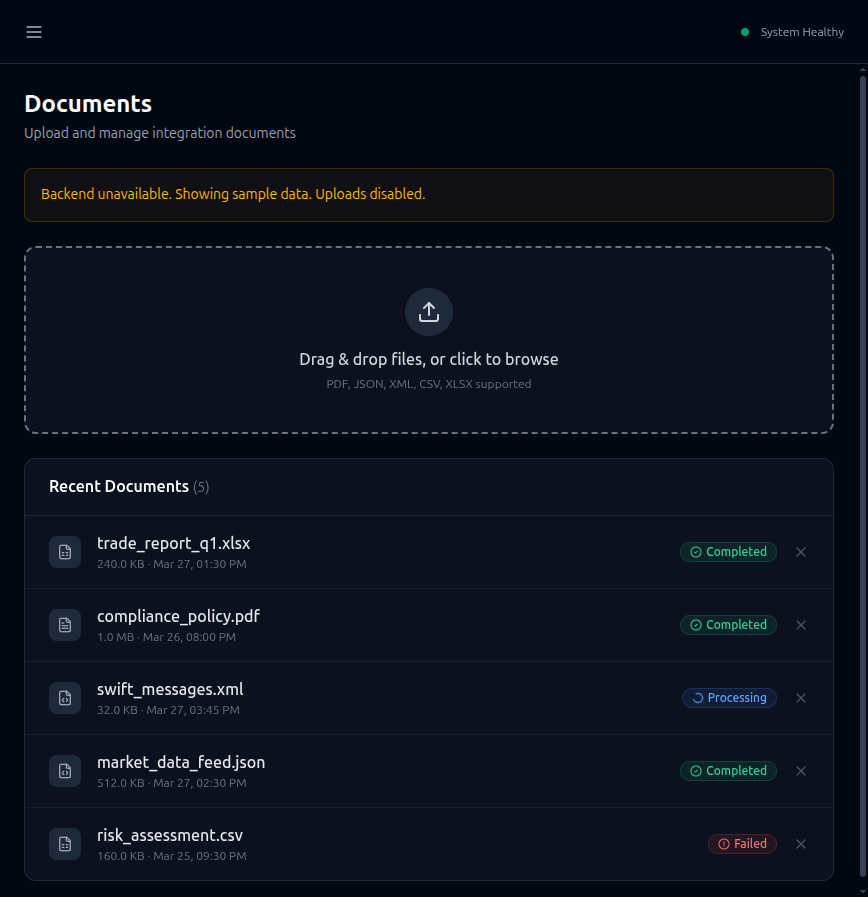
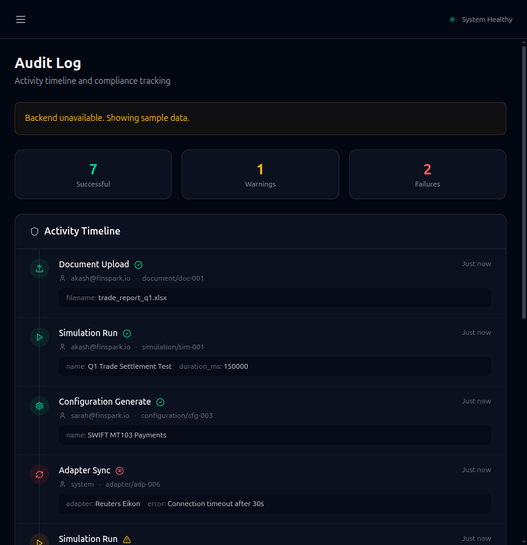
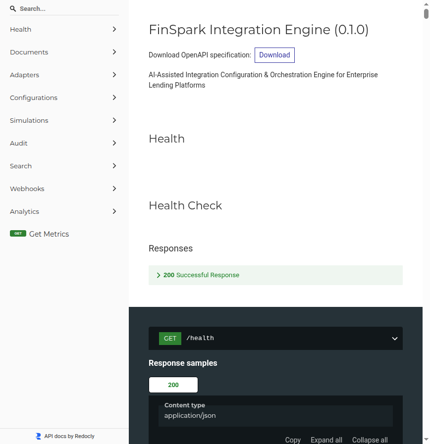
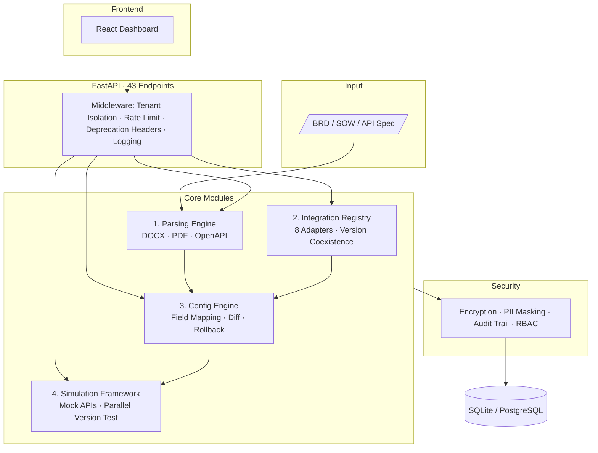

<div align="center">

# FinSpark

### AI-Assisted Integration Configuration & Orchestration Engine

*Configure Enterprise Integrations from Intent, Not Code*

<br/>


<br/>

**Team Nucleolus** · FinSpark Hackathon

</div>

---

## The Problem

Enterprise lending platforms integrate with **bureaus, KYC providers, GST services, fraud engines, payment gateways**, and open banking APIs. Each integration takes **2+ weeks** of manual BRD analysis, repetitive schema mapping, version management, and sandbox testing — all before a single API call hits production.

## Our Solution

FinSpark is an **AI-powered orchestration engine** that parses requirement documents, auto-generates integration configurations with intelligent field mapping, and validates them through simulated testing — reducing integration setup from **14 days to under 90 minutes**.

---

## Preview

<table>
<tr>
<td width="50%">

**Dashboard**


</td>
<td width="50%">

**Adapter Catalog**


</td>
</tr>
<tr>
<td width="50%">

**Document Upload & Parsing**


</td>
<td width="50%">

**Audit Trail**


</td>
</tr>
<tr>
<td colspan="2">

**API Documentation — 33 endpoints, OpenAPI 3.1**


</td>
</tr>
</table>

---

## Architecture



---

## Features

### Module 1 — Requirement Parsing Engine
- **Multi-format support** — DOCX, PDF, OpenAPI YAML/JSON with auto-detection
- **Entity extraction** — API endpoints, field names, auth schemes, SLA requirements
- **Service detection** — Identifies CIBIL, Experian, Razorpay, GSTN, etc. from document text
- **Confidence scoring** — Every extracted entity gets a 0–1 confidence score

### Module 2 — Integration Registry & Hook Library
- **8 pre-built adapters** — CIBIL (v1+v2), eKYC, GST, Payment, Fraud, SMS, Account Aggregator, Email
- **Version coexistence** — v1 and v2 of the same adapter run simultaneously
- **Deprecation tracking** — Sunset headers, migration guides, version health checks
- **Webhook system** — Register, test, and manage integration event hooks

### Module 3 — Auto-Configuration Engine
- **Intelligent field mapping** — 150+ Indian fintech domain synonyms + fuzzy matching
- **Config diff** — Side-by-side comparison with breaking change detection
- **8-rule validator** — Auth, endpoints, mappings, retry, timeout, hooks, confidence checks
- **Rollback** — Full version history with point-in-time restore
- **Templates** — Pre-built configs for Bureau, KYC, Payment, GST patterns
- **Lifecycle FSM** — `draft → configured → testing → active → deprecated`

### Module 4 — Simulation & Testing Framework
- **Mock API server** — Schema-driven responses with realistic Indian fintech data
- **10-step validation** — Structure, mappings, endpoints, auth, hooks, errors, retry
- **Parallel version testing** — Same request against v1 and v2, compare results
- **SSE streaming** — Real-time simulation progress via Server-Sent Events

### Security & Compliance
- **AES-256 encryption** for stored credentials
- **PII masking** — Aadhaar, PAN, phone, email auto-redacted in logs
- **Immutable audit trail** — Actor, action, resource, timestamp for every change
- **Multi-tenant isolation** — Row-level scoping via middleware
- **Rate limiting** — Per-tenant token bucket with 429 + Retry-After

### Platform
- **Natural language search** — "show active KYC integrations" → filtered results
- **Analytics dashboard** — Metrics, health scores, integration stats
- **Batch operations** — Validate/simulate multiple configs in one call
- **Config export** — Download as JSON or YAML

---

## Quick Start

```bash
# Clone and setup
git clone https://github.com/S-Akash-A/finspark.git
cd finspark
python -m venv .venv && source .venv/bin/activate
pip install -e ".[dev]"

# Start backend (seeds 8 adapters automatically)
make run
# → http://localhost:8000/docs

# Start frontend
cd frontend && npm install && npm run dev
# → http://localhost:5173

# Or use Docker
docker compose up --build
```

### Run the Demo
```bash
python scripts/demo.py       # Full E2E flow with colored output
python scripts/seed_data.py  # Populate all adapter integrations
```

### Run Tests
```bash
make test    # 381 tests, 80% coverage
make lint    # Ruff lint + format check
```

---

## Live Test Results

<details>
<summary><b>Health Check</b></summary>

```json
{ "status": "healthy", "version": "0.1.0", "checks": { "database": "ok", "ai_enabled": false } }
```
</details>

<details>
<summary><b>Adapter Registry — 8 adapters, 9 versions</b></summary>

```
CIBIL Credit Bureau   [bureau]       → v1 (active), v2 (active)
Aadhaar eKYC Provider [kyc]          → v1 (active)
GST Verification      [gst]          → v1 (active)
Payment Gateway       [payment]      → v1 (active)
Fraud Detection       [fraud]        → v1 (active)
SMS Gateway           [notification] → v1 (active)
Account Aggregator    [open_banking] → v1 (active)
Email Gateway         [notification] → v1 (active)
```
</details>

<details>
<summary><b>Document Parsing — OpenAPI spec → structured data</b></summary>

```
Title:      CIBIL Credit Bureau API
Confidence: 0.95
Endpoints:  3 (POST /scores, POST /reports, POST /batch/inquiries)
Fields:     19 extracted with types and required flags
Auth:       2 schemes (oauth2, apiKey)
```
</details>

<details>
<summary><b>Simulation — 10-step validation</b></summary>

```
✓ config_structure_validation    1ms  conf=1.0
✗ field_mapping_validation       1ms  conf=0.32
✓ endpoint_test_/scores          1ms  conf=0.9
✓ endpoint_test_/reports         1ms  conf=0.9
✓ endpoint_test_/batch/inquiries 1ms  conf=0.9
✓ endpoint_test_/consent/verify  1ms  conf=0.9
✓ auth_config_validation         1ms  conf=1.0
✓ hooks_validation               1ms  conf=1.0
✓ error_handling_validation      1ms  conf=0.67
✓ retry_logic_validation         1ms  conf=1.0
→ 9/10 passed in 10ms
```
</details>

<details>
<summary><b>PII Masking</b></summary>

```
Aadhaar: 1234 5678 9012  →  XXXX-XXXX-XXXX
PAN:     ABCDE1234F      →  XXXXX****X
Phone:   +91 9876543210  →  +91 XXXXXXXXXX
Email:   test@example.com → ***@***.***
```
</details>

<details>
<summary><b>Config Diff — Breaking change detection</b></summary>

```
⚠ BREAKING  auth.type          api_key → oauth2
⚠ BREAKING  base_url           .../v1  → .../v2
⚠ BREAKING  endpoints[0].path  /credit-score → /scores
⚠ BREAKING  endpoints[1]       (added)
⚠ BREAKING  version            v1 → v2
→ 5 changes, 5 breaking
```
</details>

---

## Evaluation Criteria Mapping

| Criterion | Weight | Implementation |
|:----------|:------:|:---------------|
| **Enterprise Realism** | 20% | Multi-tenant middleware, 8 Indian fintech adapters (PAN/Aadhaar/GSTIN/IFSC schemas), immutable audit trail, credential vaulting, lifecycle FSM, OpenAPI 3.1 docs |
| **AI Practicality** | 15% | 150+ domain synonyms, fuzzy matching (rapidfuzz), confidence scoring on every extraction, rule-based + AI hybrid, graceful degradation |
| **Backward Compatibility** | 15% | CIBIL v1+v2 coexistence, config diff with breaking change flags, parallel version testing, Sunset headers, migration guides, rollback |
| **Multi-Tenant Scalability** | 15% | Row-level isolation, tenant-scoped queries, per-tenant rate limiting, isolated audit trails, tenant selector in UI |
| **Security & Compliance** | 15% | AES-256 Fernet encryption, PII masking (Aadhaar/PAN/phone/email), structured audit logs, RBAC, rate limiting with 429 |
| **Business Impact** | 10% | 14 days → 90 minutes per integration, 80 engineer-hours saved, zero-code config generation, automated validation |
| **Deployability** | 10% | `make run`, `docker compose up`, `python scripts/demo.py`, 381 tests at 80% coverage, GitHub Actions CI |

---

## Tech Stack

| Layer | Stack |
|:------|:------|
| Backend | Python 3.12 · FastAPI · SQLAlchemy 2.0 (async) · Pydantic v2 |
| Frontend | React 18 · TypeScript · Vite · Tailwind CSS · Recharts |
| Database | SQLite (demo) → PostgreSQL (production-ready) |
| Testing | pytest · pytest-asyncio · httpx · 381 tests |
| Tooling | Ruff · mypy · GitHub Actions · Docker Compose |
| Security | cryptography (Fernet) · PyJWT · python-jose |
| AI/NLP | rapidfuzz · domain synonym engine · regex entity extraction |

---

## API Surface

**33 paths · 43 endpoints** — full interactive docs at `/docs` (Swagger) or `/redoc`

| Group | Endpoints | Highlights |
|:------|:---------:|:-----------|
| Documents | 3 | Upload (multipart), parse, list |
| Adapters | 4 | Catalog, versions, deprecation, matching |
| Configurations | 12 | Generate, validate, diff, export, templates, batch, transition, rollback |
| Simulations | 3 | Run, results, SSE stream |
| Audit | 1 | Filtered query (action, resource, date) |
| Search | 1 | Natural language query |
| Webhooks | 4 | CRUD + test delivery |
| Analytics | 3 | Dashboard metrics, health, platform metrics |

---

## Project Stats

```
57 source files  ·  5,978 lines of backend code
29 test files    ·  5,102 lines of tests
14 frontend files
381 tests passing · 80% coverage · lint clean
43 API endpoints · 8 adapters · 50 features
```

---

## Team Nucleolus

| Role | Name | Roll No. |
|:-----|:-----|:---------|
| **Team Lead** | **S Akash** | 2201EE54 |
| Team Member | Swayam Jain | 2201EE72 |
| Team Member | Yash Kamdar | 2201AI47 |

---

<div align="center">

*Built for the FinSpark Hackathon*

</div>
