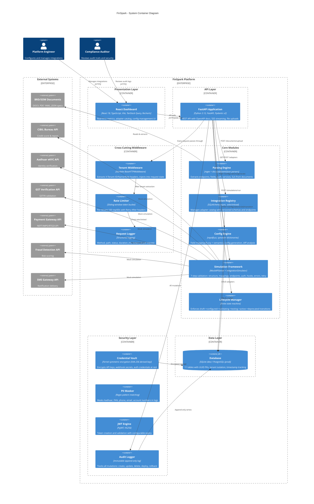
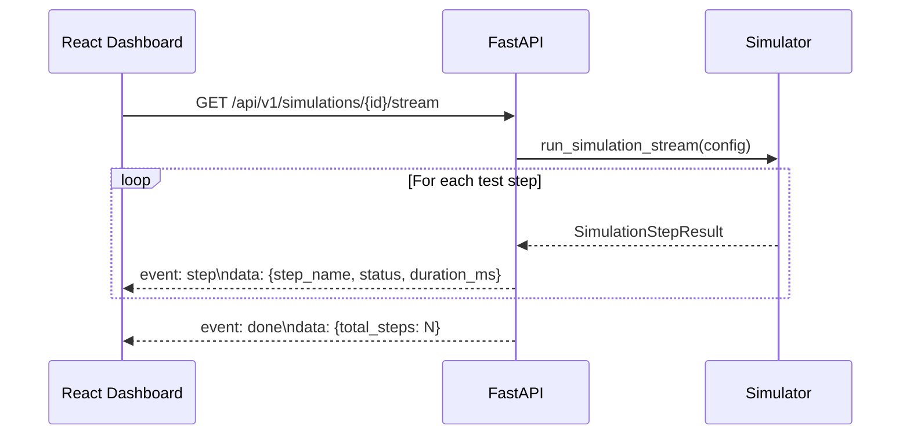
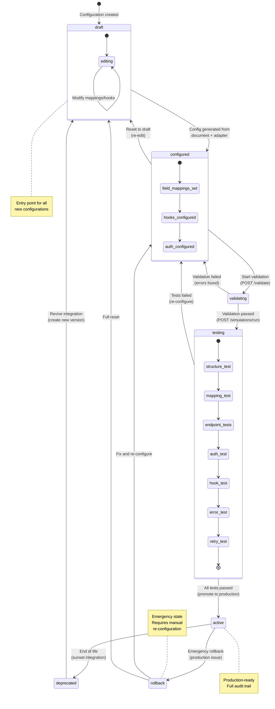
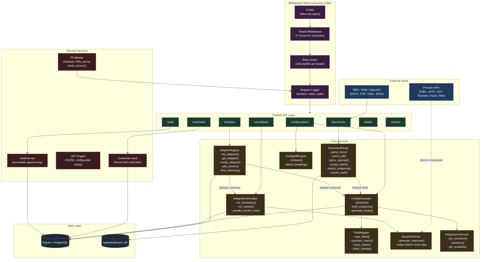
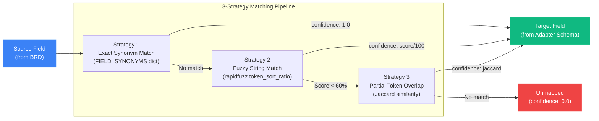
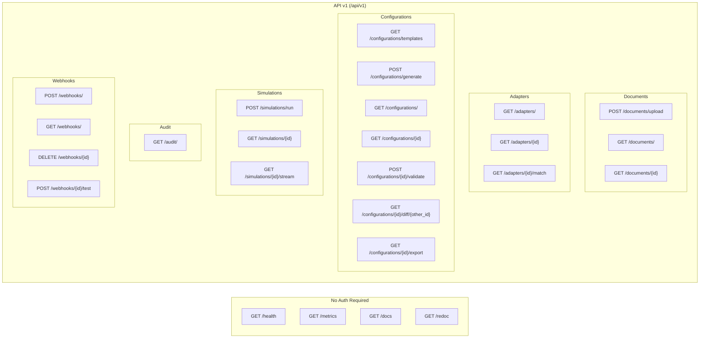
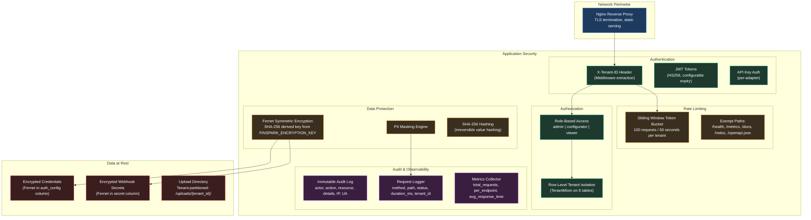

# FinSpark Architecture Documentation

> AI-Assisted Integration Configuration & Orchestration Engine for Enterprise Lending Platforms

---

## Table of Contents

1. [System Overview](#1-system-overview)
2. [Data Flow](#2-data-flow)
3. [Database Schema](#3-database-schema)
4. [Integration Lifecycle State Machine](#4-integration-lifecycle-state-machine)
5. [Module Interaction](#5-module-interaction)
6. [API Route Map](#6-api-route-map)
7. [Security Architecture](#7-security-architecture)

---

## 1. System Overview

FinSpark is a multi-tenant platform that automates the configuration and testing of third-party API integrations for Indian lending platforms. It parses BRD/SOW documents, matches them to pre-built adapters (CIBIL, eKYC, GST, Payment, Fraud, SMS), generates integration configurations with intelligent field mapping, and validates them through a simulation framework -- all without writing code.

### C4 Container Diagram



### Component Summary

| Layer | Component | Technology | Responsibility |
|-------|-----------|------------|----------------|
| Frontend | React Dashboard | React 18, TypeScript, Vite, Recharts | Metrics visualization, adapter browsing, config management |
| API | FastAPI Application | FastAPI, Pydantic v2, Uvicorn | REST endpoints, OpenAPI docs, SSE streaming |
| Middleware | Tenant Middleware | Starlette | Multi-tenant context injection via X-Tenant-ID header |
| Middleware | Rate Limiter | In-memory sliding window | 100 requests/60s per tenant, 429 with Retry-After |
| Middleware | Request Logger | Python logging | Structured request/response metrics |
| Module | Parsing Engine | python-docx, pypdf, PyYAML | Document parsing and entity extraction |
| Module | Integration Registry | SQLAlchemy async | Adapter catalog with versioned schemas |
| Module | Config Engine | rapidfuzz | Fuzzy field mapping, config generation, diff engine |
| Module | Simulation Framework | MockAPIServer | 7-step mock integration testing |
| Module | Lifecycle Manager | FSM dataclass | State transition enforcement with audit trail |
| Security | Credential Vault | cryptography.Fernet | Symmetric encryption for secrets at rest |
| Security | PII Masker | Regex | Aadhaar, PAN, phone, email, account masking |
| Security | JWT Engine | PyJWT | HS256 token management |
| Security | Audit Logger | SQLAlchemy | Immutable audit trail for all mutations |
| Data | Database | SQLite/PostgreSQL | 11 tables, UUID PKs, async sessions |

---

## 2. Data Flow

### End-to-End Integration Configuration Flow

```mermaid
sequenceDiagram
    autonumber
    participant U as Platform Engineer
    participant FE as React Dashboard
    participant API as FastAPI Gateway
    participant TM as Tenant Middleware
    participant RL as Rate Limiter
    participant PE as Parsing Engine
    participant AR as Adapter Registry
    participant CE as Config Engine
    participant FM as Field Mapper
    participant SF as Simulation Framework
    participant MS as Mock API Server
    participant LC as Lifecycle Manager
    participant AL as Audit Logger
    participant CV as Credential Vault
    participant DB as Database

    rect rgb(30, 41, 59)
        Note over U,DB: Phase 1 - Document Upload & Parsing
        U->>FE: Upload BRD/SOW document
        FE->>API: POST /api/v1/documents/upload<br/>(multipart/form-data)
        API->>TM: Extract tenant from X-Tenant-ID header
        TM->>RL: Check rate limit (100 req/60s)
        RL-->>API: Allowed
        API->>PE: parse(file_path, doc_type)
        PE->>PE: Detect format (docx/pdf/yaml/json)

        alt DOCX/PDF Document
            PE->>PE: Extract full text from paragraphs & tables
            PE->>PE: Regex extraction: endpoints, fields, auth, services
            PE->>PE: Extract sections, security reqs, SLA reqs
        else OpenAPI YAML/JSON
            PE->>PE: Parse paths -> endpoints
            PE->>PE: Parse components/schemas -> fields
            PE->>PE: Parse securitySchemes -> auth requirements
        end

        PE-->>API: ParsedDocumentResult {endpoints, fields, auth, services, confidence}
        API->>DB: INSERT document (status=parsed)
        API->>AL: log(upload_document, document, doc.id)
        AL->>DB: INSERT audit_log
        API-->>FE: DocumentUploadResponse {id, status, filename}
    end

    rect rgb(30, 50, 40)
        Note over U,DB: Phase 2 - Adapter Matching
        U->>FE: Browse adapter catalog
        FE->>API: GET /api/v1/adapters/?category=bureau
        API->>AR: list_adapters(category)
        AR->>DB: SELECT adapters JOIN adapter_versions
        DB-->>AR: Adapter[] with versions
        AR-->>API: Adapters with endpoints, schemas, auth types
        API-->>FE: AdapterListResponse {adapters, categories}
        U->>FE: Select adapter version (e.g., CIBIL v2)
    end

    rect rgb(50, 30, 40)
        Note over U,DB: Phase 3 - Configuration Generation
        U->>FE: Generate config (document + adapter version)
        FE->>API: POST /api/v1/configurations/generate<br/>{document_id, adapter_version_id, name}
        API->>DB: Fetch parsed document + adapter version
        API->>CE: generate(parsed_result, adapter_version)
        CE->>FM: map_fields(source_fields, target_fields)

        loop For each source field
            FM->>FM: Strategy 1: Exact synonym match<br/>(FIELD_SYNONYMS dictionary)
            FM->>FM: Strategy 2: Fuzzy match<br/>(rapidfuzz token_sort_ratio >= 60%)
            FM->>FM: Strategy 3: Partial token overlap<br/>(Jaccard similarity >= 0.6)
        end

        FM-->>CE: FieldMapping[] with confidence scores
        CE->>CE: Build endpoint configs
        CE->>CE: Generate transformation rules
        CE->>CE: Attach default hooks (audit_logger, pii_masker, schema_validator)
        CE->>CE: Set retry policy {max_retries: 3, backoff: 2}
        CE-->>API: Complete config JSON

        API->>DB: INSERT configuration (status=configured)
        API->>DB: INSERT configuration_history (version=1)
        API->>AL: log(generate_config, configuration, config.id)
        API-->>FE: ConfigurationResponse {id, field_mappings, status}
    end

    rect rgb(40, 30, 60)
        Note over U,DB: Phase 4 - Simulation & Testing
        U->>FE: Run simulation
        FE->>API: POST /api/v1/simulations/run<br/>{configuration_id, test_type: "full"}
        API->>DB: Fetch configuration
        API->>SF: run_simulation(full_config, "full")

        SF->>SF: Step 1: Validate config structure<br/>(required keys: adapter_name, version, base_url, auth, endpoints, field_mappings)
        SF->>SF: Step 2: Validate field mappings<br/>(coverage >= 70%, low confidence <= 30%)

        loop For each enabled endpoint
            SF->>MS: generate_response(endpoint, request_payload)
            MS->>MS: Generate mock data from Indian fintech domain<br/>(PAN, Aadhaar, GSTIN, IFSC, etc.)
            MS-->>SF: Mock API response
            SF->>SF: Step 3+: Validate endpoint response
        end

        SF->>SF: Step N-2: Validate auth configuration
        SF->>SF: Step N-1: Validate hooks (pre_request, post_response, on_error, on_timeout)
        SF->>SF: Step N: Test error handling (retry policy, timeout, error hooks)
        SF->>SF: Step N+1: Test retry logic (max_retries 1-5, backoff, status codes)

        SF-->>API: SimulationStepResult[] {step_name, status, duration_ms, confidence_score}
        API->>DB: INSERT simulation + simulation_steps
        API->>DB: UPDATE configuration.status = "testing" (if all passed)
        API->>AL: log(run_simulation, simulation, sim.id)
        API-->>FE: SimulationResponse {passed: N, failed: M, steps}
    end

    rect rgb(30, 45, 50)
        Note over U,DB: Phase 5 - Deploy (Lifecycle Transition)
        U->>FE: Promote to Active
        FE->>API: POST /api/v1/configurations/{id}/transition<br/>{target_state: "active"}
        API->>LC: transition(TESTING -> ACTIVE)
        LC->>LC: Validate transition allowed (FSM check)
        LC-->>API: AuditEntry {from_state, to_state, timestamp}
        API->>DB: UPDATE configuration.status = "active"
        API->>AL: log(deploy, configuration, config.id)
        API-->>FE: TransitionResponse {previous_state, new_state}
    end
```



### SSE Streaming Flow (Real-Time Simulation)



---

## 3. Database Schema

### Entity-Relationship Diagram

```mermaid
erDiagram
    tenants {
        string id PK "UUID v4"
        string name "NOT NULL, VARCHAR(255)"
        string slug "UNIQUE, VARCHAR(100)"
        text description "nullable"
        boolean is_active "DEFAULT true"
        text settings "JSON - tenant preferences"
        datetime created_at "server_default now()"
        datetime updated_at "onupdate now()"
    }

    documents {
        string id PK "UUID v4"
        string tenant_id FK "INDEX, NOT NULL"
        string filename "NOT NULL, VARCHAR(500)"
        string file_type "NOT NULL (docx|pdf|yaml|json)"
        integer file_size "DEFAULT 0"
        string doc_type "NOT NULL (brd|sow|api_spec|other)"
        string status "(uploaded|parsing|parsed|failed)"
        text raw_text "nullable, first 5000 chars"
        text parsed_result "JSON - ParsedDocumentResult"
        text error_message "nullable"
        datetime created_at "server_default now()"
        datetime updated_at "onupdate now()"
    }

    adapters {
        string id PK "UUID v4"
        string name "NOT NULL, VARCHAR(255)"
        string category "NOT NULL (bureau|kyc|gst|payment|fraud|notification)"
        text description "nullable"
        boolean is_active "DEFAULT true"
        string icon "nullable, VARCHAR(50)"
        datetime created_at "server_default now()"
        datetime updated_at "onupdate now()"
    }

    adapter_versions {
        string id PK "UUID v4"
        string adapter_id FK "NOT NULL -> adapters.id"
        string version "NOT NULL, VARCHAR(20)"
        integer version_order "DEFAULT 0"
        string status "(active|deprecated|beta)"
        string base_url "nullable, VARCHAR(500)"
        string auth_type "(api_key|oauth2|certificate|api_key_certificate)"
        text request_schema "JSON Schema"
        text response_schema "JSON Schema"
        text endpoints "JSON array of endpoint objects"
        text config_template "JSON default config"
        text changelog "nullable"
        datetime created_at "server_default now()"
        datetime updated_at "onupdate now()"
    }

    configurations {
        string id PK "UUID v4"
        string tenant_id FK "INDEX, NOT NULL"
        string name "NOT NULL, VARCHAR(255)"
        string adapter_version_id FK "NOT NULL -> adapter_versions.id"
        string document_id FK "nullable -> documents.id"
        string status "(draft|configured|validating|testing|active|deprecated|rollback)"
        integer version "DEFAULT 1"
        text field_mappings "JSON array of FieldMapping"
        text transformation_rules "JSON array of TransformationRule"
        text hooks "JSON array of HookConfig"
        text auth_config "JSON, Fernet encrypted"
        text full_config "JSON - complete configuration"
        text notes "nullable"
        datetime created_at "server_default now()"
        datetime updated_at "onupdate now()"
    }

    configuration_history {
        string id PK "UUID v4"
        string tenant_id FK "INDEX, NOT NULL"
        string configuration_id FK "NOT NULL -> configurations.id"
        integer version "NOT NULL"
        string change_type "(created|updated|status_change)"
        text previous_value "JSON nullable"
        text new_value "JSON nullable"
        string changed_by "nullable, VARCHAR(255)"
        datetime created_at "server_default now()"
        datetime updated_at "onupdate now()"
    }

    simulations {
        string id PK "UUID v4"
        string tenant_id FK "INDEX, NOT NULL"
        string configuration_id FK "NOT NULL -> configurations.id"
        string status "(pending|running|passed|failed|error)"
        string test_type "(full|smoke|schema_only|parallel_version)"
        integer total_tests "DEFAULT 0"
        integer passed_tests "DEFAULT 0"
        integer failed_tests "DEFAULT 0"
        integer duration_ms "nullable"
        text results "JSON array of SimulationStepResult"
        text error_log "nullable"
        datetime created_at "server_default now()"
        datetime updated_at "onupdate now()"
    }

    simulation_steps {
        string id PK "UUID v4"
        string simulation_id FK "NOT NULL -> simulations.id"
        string step_name "NOT NULL, VARCHAR(255)"
        integer step_order "DEFAULT 0"
        string status "(pending|passed|failed|skipped|error)"
        text request_payload "JSON"
        text expected_response "JSON"
        text actual_response "JSON"
        integer duration_ms "nullable"
        float confidence_score "nullable, 0.0-1.0"
        text error_message "nullable"
        datetime created_at "server_default now()"
        datetime updated_at "onupdate now()"
    }

    audit_logs {
        string id PK "UUID v4"
        string tenant_id FK "INDEX, NOT NULL"
        string actor "NOT NULL, VARCHAR(255)"
        string action "NOT NULL (create|update|delete|deploy|rollback)"
        string resource_type "NOT NULL (configuration|adapter|simulation|document)"
        string resource_id "NOT NULL, VARCHAR(36)"
        text details "JSON nullable"
        string ip_address "nullable, VARCHAR(45)"
        string user_agent "nullable, VARCHAR(500)"
        datetime created_at "server_default now()"
        datetime updated_at "onupdate now()"
    }

    webhooks {
        string id PK "UUID v4"
        string tenant_id FK "INDEX, NOT NULL"
        string url "NOT NULL, VARCHAR(2048)"
        string secret "NOT NULL, Fernet encrypted"
        text events "JSON list of event types"
        boolean is_active "DEFAULT true"
        datetime created_at "server_default now()"
        datetime updated_at "onupdate now()"
    }

    webhook_deliveries {
        string id PK "UUID v4"
        string webhook_id FK "NOT NULL -> webhooks.id, ON DELETE CASCADE"
        string event_type "NOT NULL, VARCHAR(100)"
        text payload "JSON, NOT NULL"
        string status "(pending|delivered|failed)"
        integer response_code "nullable"
        integer attempts "DEFAULT 0"
        datetime created_at "server_default now()"
        datetime updated_at "onupdate now()"
    }

    adapters ||--o{ adapter_versions : "has versions"
    configurations }o--|| adapter_versions : "uses"
    configurations }o--o| documents : "generated from"
    configurations ||--o{ configuration_history : "has history"
    configurations ||--o{ simulations : "tested by"
    simulations ||--o{ simulation_steps : "contains steps"
    webhooks ||--o{ webhook_deliveries : "delivers to"
```



### Table Count: 11 Tables

| Table | Row-Level Tenant Isolation | Purpose |
|-------|:-:|---------|
| `tenants` | -- | Tenant registry and settings |
| `documents` | Yes | Uploaded BRD/SOW/API spec files |
| `adapters` | -- | Pre-built adapter catalog (global) |
| `adapter_versions` | -- | Versioned adapter schemas (global) |
| `configurations` | Yes | Generated integration configs per tenant |
| `configuration_history` | Yes | Version history of config changes |
| `simulations` | Yes | Simulation/test run records |
| `simulation_steps` | -- | Individual test steps within simulations |
| `audit_logs` | Yes | Immutable audit trail |
| `webhooks` | Yes | Registered webhook endpoints |
| `webhook_deliveries` | -- | Webhook delivery attempt records |

---

## 4. Integration Lifecycle State Machine



### Transition Rules

| From State | Allowed Targets | Trigger |
|-----------|----------------|---------|
| `draft` | `configured` | Config generation from document + adapter |
| `configured` | `validating`, `draft` | Start validation or reset |
| `validating` | `testing`, `configured` | Pass/fail validation |
| `testing` | `active`, `configured` | Pass/fail simulation |
| `active` | `deprecated`, `rollback` | Sunset or emergency |
| `deprecated` | `draft` | Revive as new version |
| `rollback` | `configured`, `draft` | Fix or full reset |

---

## 5. Module Interaction Diagram



### Field Mapping Strategy Pipeline



---

## 6. API Route Map

### Route Overview



### Detailed Endpoint Reference

| Method | Path | Tags | Description | Tenant-Scoped |
|--------|------|------|-------------|:---:|
| `GET` | `/health` | Health | Healthcheck with DB and AI status | No |
| `GET` | `/metrics` | Metrics | In-memory request metrics snapshot | No |
| `POST` | `/api/v1/documents/upload` | Documents | Upload and parse BRD/SOW/spec | Yes |
| `GET` | `/api/v1/documents/` | Documents | List tenant documents | Yes |
| `GET` | `/api/v1/documents/{id}` | Documents | Get document with parsed result | Yes |
| `GET` | `/api/v1/adapters/` | Adapters | List adapters, optional `?category=` | No |
| `GET` | `/api/v1/adapters/{id}` | Adapters | Get adapter with all versions | No |
| `GET` | `/api/v1/adapters/{id}/match` | Adapters | Find adapters matching services | No |
| `GET` | `/api/v1/configurations/templates` | Configurations | List pre-built config templates | No |
| `POST` | `/api/v1/configurations/generate` | Configurations | Generate config from document + adapter | Yes |
| `GET` | `/api/v1/configurations/` | Configurations | List tenant configurations | Yes |
| `GET` | `/api/v1/configurations/{id}` | Configurations | Get configuration detail | Yes |
| `POST` | `/api/v1/configurations/{id}/validate` | Configurations | Validate config completeness | Yes |
| `GET` | `/api/v1/configurations/{a}/diff/{b}` | Configurations | Compare two configurations | Yes |
| `GET` | `/api/v1/configurations/{id}/export` | Configurations | Export as JSON or YAML file | Yes |
| `POST` | `/api/v1/simulations/run` | Simulations | Run simulation against config | Yes |
| `GET` | `/api/v1/simulations/{id}` | Simulations | Get simulation results | Yes |
| `GET` | `/api/v1/simulations/{id}/stream` | Simulations | Stream results via SSE | Yes |
| `GET` | `/api/v1/audit/` | Audit | Query audit logs (paginated) | Yes |
| `POST` | `/api/v1/webhooks/` | Webhooks | Register webhook endpoint | Yes |
| `GET` | `/api/v1/webhooks/` | Webhooks | List tenant webhooks | Yes |
| `DELETE` | `/api/v1/webhooks/{id}` | Webhooks | Delete webhook | Yes |
| `POST` | `/api/v1/webhooks/{id}/test` | Webhooks | Send test event to webhook | Yes |

---

## 7. Security Architecture



### PII Detection Patterns

| PII Type | Regex Pattern | Mask Output |
|----------|--------------|-------------|
| Aadhaar | `\b\d{4}[\s-]?\d{4}[\s-]?\d{4}\b` | `XXXX-XXXX-XXXX` |
| PAN | `\b[A-Z]{5}\d{4}[A-Z]\b` | `XXXXX****X` |
| Phone | `\b(?:\+91[\s-]?)?\d{10}\b` | `XXXXXXXXXX` |
| Email | `\b[A-Za-z0-9._%+-]+@[A-Za-z0-9.-]+\.[A-Z\|a-z]{2,}\b` | `***@***.***` |
| Account | `\b\d{9,18}\b` | `XXXXXXXXXX` |

### Security Configuration (Environment Variables)

| Variable | Purpose | Default |
|----------|---------|---------|
| `FINSPARK_SECRET_KEY` | JWT signing key | `change-me-in-production-use-openssl-rand-hex-32` |
| `FINSPARK_ENCRYPTION_KEY` | Fernet key derivation seed | `change-me-in-production` |
| `FINSPARK_JWT_ALGORITHM` | JWT algorithm | `HS256` |
| `FINSPARK_JWT_EXPIRY_MINUTES` | Token TTL | `60` |
| `FINSPARK_DATABASE_URL` | DB connection string | `sqlite+aiosqlite:///./finspark.db` |

### Middleware Execution Order

Middleware is applied in reverse registration order (last added = first executed):

```
Request  -->  RequestLoggingMiddleware  (logs timing)
         -->  RateLimiterMiddleware     (enforces limits)
         -->  TenantMiddleware          (extracts tenant)
         -->  CORSMiddleware            (CORS headers)
         -->  Route Handler
Response <--  (same stack, reversed)
```
